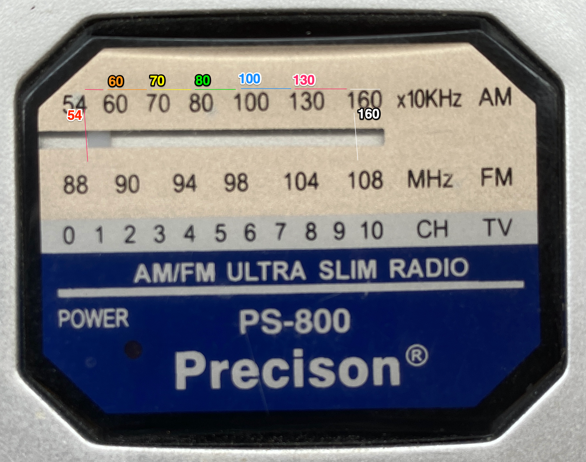

# AnalogRead_Keras
This project shows an example of how to use a Keras model to implement regression bases on images.

## Installation
1. Pull the code
2. Create a Python environment and activate it

*e.g.* 
`virtualenv -p python3 .venv`
`source .venv/bin/activate`

3. Install requirements

*e.g.*
`pip install -r requirements.txt`

4. There are 2 notebooks (main.ipynb, augment/augment.ipynb), one for the training process and the other one for the image augmentation process

- The augmentation is done by using the [Augmentor](https://github.com/mdbloice/Augmentor) package

- The regression process is based on the [Clock-Reader](https://github.com/shivaverma/Clock-Reader) repository

5. To generate the images, run the generator notebook and copy the files from *augment/images* into *images/*

*Value/class* names are taken from the file name
*e.g.*
- 54_original_54.JPG_0a8d3daf-91f5-4f1e-8474-af9e4c76c44b will be marked as having a value of 54
- 155_original_155.JPG_7c4b0a45-03e8-474b-b7ba-70f9bf803160 will be marked as having a value of 155

The regression is done to predict the value of the radio frequency
*e.g.*

